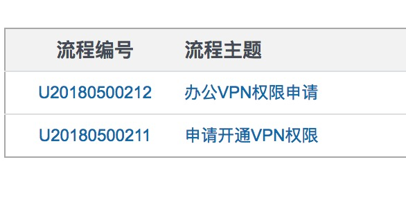
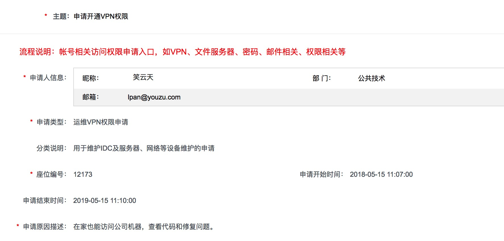

## 2018 游族 工作日志

### 待解决
- VPN权限
- 机器权限

### 疑问
- PHP版本 ？
- workflow是什么 ？
- onesdk 与 supersdk 区别 ？
- 框架版本 ？ 命名规范混乱 ？
- 每个版本对应的相应PHP版本和框架相关版本等等 ？

### 2018-05-18
- current
    - [ ] 深入查看supersdk的代码，以及yii1框架代码深入研究下
- note
    - PHP源码调试
        - https://gywbd.github.io/posts/2016/2/debug-php-source-code.html
    
### 2018-05-17
- current
    - [ ] supervisor熟悉
        - supervisorctl status
        1. supervisord: 初始启动Supervisord，启动、管理配置中设置的进程;
        2. supervisorctl stop(start, restart) xxx，停止（启动，重启）某一个进程(xxx);
        3. supervisorctl reread: 只载入最新的配置文件, 并不重启任何进程;
        4. supervisorctl reload: 载入最新的配置文件，停止原来的所有进程并按新的配置启动管理所有进程;
        5. supervisorctl update: 根据最新的配置文件，启动新配置或有改动的进程，配置没有改动的进程不会受影响而重启;
    - [ ] ppt继续完善
    - [ ] yii1 方法深入，框架深入理解

### 2018-05-16
- current
    - [ ] 继续熟悉sdk业务
    - [ ] VPN申请流程催下
    - [ ] 搞定git自己的私人目录项目

### 2018-05-15
- current 
    - [ ] 继续熟悉业务和同事
    - [ ] 安装swoole扩展
    - [ ] VPN申请
        - 运维VPN
        - 办公VPN申请
        - 
        - 

- note
    - [CSRF跨站请求伪造](https://www.cnblogs.com/hyddd/archive/2009/04/09/1432744.html)

### 2018-05-14
- current
    - [ ] yii1文档继续
    - [ ] superSDK项目查看熟悉
- note
    - ActiveRecord
    - Data Mapper
    - 单一指责原则 SRP [Single Responsibility Principle]

### 2018-05-11
- current
    - [ ] 在本机写一些yii1的demo，以熟悉yii1相关操作
    - [ ] 14点开会：讨论superSDK的商业化ing

### 2018-05-10
- current
    - [ ] 把yii1的官方文档看完
    - [ ] 在本机上运行SuperSDK的相关代码
    - [ ] 初步跑通SuperSDK的流程，顺便把相关本机环境搭建好
    - [x] 查看yoozoo文档
        - 游族网络企业介绍
        - 员工自助查询操作指引-考勤查询
        - 工作时间制度v1.4
        - YOUZU-FC-HR-003转正管理制度
        - IU爱游操作手册
    - [ ] VPN安装
- note
    - permanent: 大家公认的信息 ，永久性重定向。请求日志中的状态码为301
    - nginx conf里： if -d : 判断指定的路径是否为存在且为目录；

### 2018-05-09
- current
    - [x] 参加入职，填写入职材料
    - [x] 熟悉办公环境： 邮件 rtx 
    - [x] 初步查看yii1相关文档

