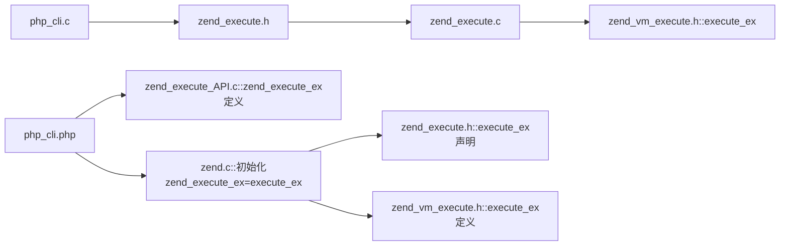

# PHP 内核学习笔记

## 执行函数链




## zend_op 结构体

```c
struct _zend_op {
    opcode_handler_t handler;   /* opcode执行时会调用的处理函数，一个C函数 */
    znode_op op1; /* 操作数1 */
    znode_op op2; /* 操作数2 */
    znode_op result; /* 结果 */
    ulong extended_value; /* 额外信息 */
    uint lineno;
    zend_uchar opcode; /* opcode代号 */
    zend_uchar op1_type; /* 操作数1的类型 */
    zend_uchar op2_type; /* 操作数2的类型 */
    zend_uchar result_type; /* 结果类型 */
};
```

## 操作数类型

> Zend 引擎一共支持 5 种操作数类型

1. IS_CV：编译变量（Compiled Variable）
   1. $var 形式的变量
   2. vld 中以 `!0`、`!1` 形式出现

2. IS_VAR：Zend 引擎内部使用的变量
    1. **它可以被其他的 opcode 重用**，只能 Zend 引擎内部使用
    2. vld 中以 `$0`、`$1` 形式出现

3. IS_TMP_VAR：Zend 引擎内部使用的变量

    1. **不能被其他的 opcode 重用**
    2. vld 中以 `~0`、`~1` 形式存在

4. IS_CONST：表示一个常量

    1. 只读的，值不可改变
    2. vld 中直接以常量值的形式出现

5. IS_UNUSED：表示操作数没有被使用

    1. 从 opcode 的结构体（如上）中看到它包含 op1、op2、result 以及 他们的类型

    2. 举例说明

        > 例如 `echo $a`，显然它只有一个操作数 `$a`，它是一个 IS_CV 类型，而且不会返回结果，所以这个 opcode 的 op2 的类型是 IS_UNUSED，result 的类型也是 IS_UNUSED。

## 词法分析

## 语法分析


## CG、EG、PG 等宏的含义

* CG

  > 1. `#define CG(v) (compiler_globals.v)`
  >
  > 2. `ZEND_API zend_compiler_globals compiler_globals;`
  >
  > 3. `typedef struct _zend_compiler_globals zend_compiler_globals;`
  >
  > 4. 
  >
  > 5. ```c
  >    struct _zend_compiler_globals {
  >    	zend_stack loop_var_stack;
  >    
  >    	zend_class_entry *active_class_entry;
  >    
  >    	zend_string *compiled_filename;
  >    
  >    	int zend_lineno;
  >    
  >    	zend_op_array *active_op_array;
  >    
  >    	HashTable *function_table;	/* function symbol table */
  >    	HashTable *class_table;		/* class table */
  >    
  >    	HashTable filenames_table;
  >    
  >    	HashTable *auto_globals;
  >    
  >    	zend_bool parse_error;
  >    	zend_bool in_compilation;
  >    	zend_bool short_tags;
  >    
  >    	zend_bool unclean_shutdown;
  >    
  >    	zend_bool ini_parser_unbuffered_errors;
  >    
  >    	zend_llist open_files;
  >    
  >    	struct _zend_ini_parser_param *ini_parser_param;
  >    
  >    	uint32_t start_lineno;
  >    	zend_bool increment_lineno;
  >    
  >    	zend_string *doc_comment;
  >    	uint32_t extra_fn_flags;
  >    
  >    	uint32_t compiler_options; /* set of ZEND_COMPILE_* constants */
  >    
  >    	zend_oparray_context context;
  >    	zend_file_context file_context;
  >    
  >    	zend_arena *arena;
  >    
  >    	HashTable interned_strings;
  >    
  >    	const zend_encoding **script_encoding_list;
  >    	size_t script_encoding_list_size;
  >    	zend_bool multibyte;
  >    	zend_bool detect_unicode;
  >    	zend_bool encoding_declared;
  >    
  >    	zend_ast *ast;
  >    	zend_arena *ast_arena;
  >    
  >    	zend_stack delayed_oplines_stack;
  >    
  >    #ifdef ZTS
  >    	zval **static_members_table;
  >    	int last_static_member;
  >    #endif
  >    };
  >    ```
  >
  >    
  >

* EG

* SG

* PG

* EX